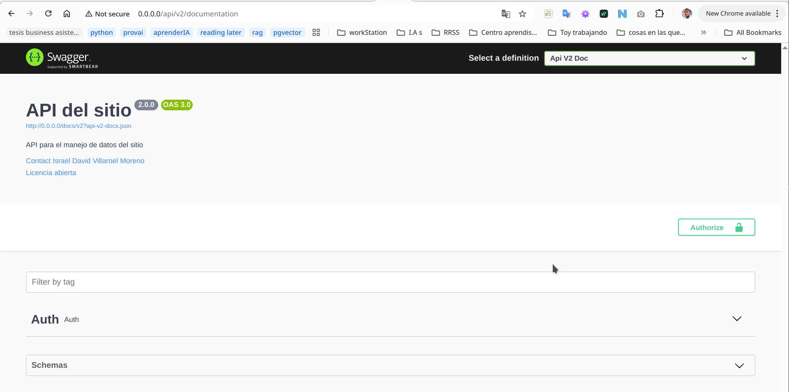
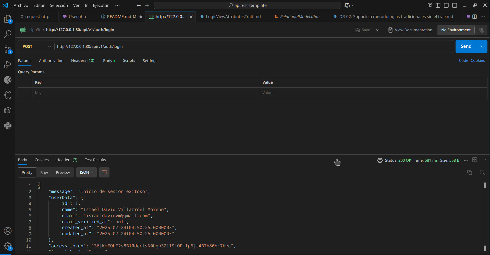

# Project Management API (Laravel)

API backend desarrollado con Laravel para gestionar proyectos y tareas. Esta implementación provee autenticación con tokens (Sanctum), documentación OpenAPI, versionado de API y una estructura lista para integrarse con un frontend (por ejemplo Vue.js).

## Objetivo
Construir una plataforma para la gestión de proyectos y tareas con:
- Autenticación y perfiles (administrador / desarrollador).
- Modelos: User, Project, Task con sus relaciones.
- API RESTful para CRUD, asignación de tareas y filtros.
- Documentación de la API y entorno listo para desarrollo con Docker (Laravel Sail).


## 🌟 Características Principales

- CRUD completo para User, Project y Task.

- Asignación de usuarios a tareas.

- Filtrado de tareas por estado, proyecto y usuario asignado.

- Validaciones centralizadas en Requests / Traits (se incluyen dos enfoques).

- Autenticación API RESTful con Laravel 
Sanctum: Configuración completa para el manejo de autenticación basada en tokens (Bearer Tokens). Rutas de registro (/api/v1/auth/register), login (/api/v1/auth/login), obtención de datos del usuario autenticado (/api/v1/auth/me) y logout (/api/v1/auth/logout) ya definidas y listas para usar.

- Documentación de API con OpenAPI (Swagger/L5-Swagger): Integración y configuración inicial de OpenAPI para generar documentación interactiva de tu API. Anotaciones y estructura base ya establecidas para que puedas documentar tus endpoints de manera eficiente.

- Versionado de API (/api/vi): Estructura de rutas ya establecida con versionado explícito (/api/vi), permitiendo una evolución ordenada de tu API sin afectar versiones anteriores.

- Incluye los archivos .http (para la extensión REST Client de VS Code) pre-configurados para probar los endpoints de autenticación de forma inmediata.

## Características a implementar


## Licencia

Este código tiene licencia bajo la licencia pública general de GNU versión 3.0 o posterior (LGPLV3+). Puedes encontrar una copia completa de la licencia en https://www.gnu.org/licenses/lgpl-3.0-standalone.html


## Getting Started

### Requisitos 

Tener instalado 
- php
- composer
- Docker

### Clonar el Repositorio

git clone https://github.com/israeldavidvm/project-management-application-fbackend.git

### Instalacion 

Ejecuta el comando para instalar laravel sail, sactum y las demas depencias
composer install

sail artisan key:generate

#### Docker
El proceso de instalacion esta gestionado por laravel sail mas concretamente por medio de docker-compose.yml

Eres libre de modificar dicho archivo a tu gusto

### Configuracinon y activacion del servidor

#### Archivo .env 

Establece una configuracion en el archivo .env. como la siguiente

```
DB_CONNECTION=<DBConnection>
DB_HOST=<Host>
DB_PORT=<Port>
DB_DATABASE=<DatabaseName>
DB_USERNAME=<UserName>
DB_PASSWORD=<Password>

DB_CONNECTION=mysql
DB_HOST=mysql      
DB_PORT=3306       
DB_DATABASE=israeldavidvm
DB_USERNAME=israeldavidvm
DB_PASSWORD=password


```

#### Activar servidor
Ejecuta el comando

sail up

#### Ejecuta migraciones
sail artisan migrate:refresh --seed


### Accede a la documentacion de la api

Utilizando la url generada por la configuracion de docker

en este caso http://127.0.0.1:80 

accede a la documentacion de la api

por medio de la url

http://127.0.0.1:80/api/v1/documentation

por medio de la url

http://127.0.0.1:80/api/v1/documentation


### Acceso a la api 

Para tener acceso a la api debes de logearte con un usuario. 
Para pruebas con la api se creo un usuario con las siguientes credenciales
un email "israeldavidvm@gmail.com" y password de "Password1234."

#### Consume la api

Puedes acceder a la api por medio de tu cliente http/https favorito postman, curl etc 

#### consumo de la api mediante rest client

El proyecto tiene un archivo de nombre request.http que puede ser usado para probar la api usando la extension de rest client

#### consumo de la api mediante swagger


#### consumo de la api mediante postman



## Engineering decisions

### Planificación, Ingeniería de Requerimientos y Gestión de Riesgos

Estas secciones del proyecto se llevarán a cabo mediante un sitio en Notion, de forma que puedan ser fácilmente accesibles por el personal no técnico.

Solicita el link de acceso al personal autorizado.

### Proposed Systems and Subsystems Based on Requirements.

La vision a alto nivel del sistema desarrollado y sus subsistemas junto a sus requerimientos se detalla en la session de sistemas y subsistemas del notion

### Folder Structured

La estructura del proyecto va a seguir las convenciones de laravel 11 he incoporara los siguientes directorios y archivos

#### /israeldavidvm 

Para la incoporacion de codigo que se planea convertir a librerias o paquetes

#### /documentation

Directorio que almacena toda la documentacion del proyecto que no se incluyo en el readme para no ser tan extensiva su extension

#### /documentation/diagrams

Directorio que almacena los diagramas que seran usados durante el proyecto como MER, Modelo relacional, diagramas de aquitectura etc

#### /documentation/DR

Directorio donde seran almacenados los Registros de desicion (Decission Records) utilizados para registrar las decisiones tecnicas

#### /request.http

Contiene un archivo que puede usarse para probar las api por medio de rest client

#### app/Swagger

Se utiliza para almacenar elementos utilizados par ala generacion de documentacion por medio de open api (anteriormente conocida como swagger)

##### app/Swagger/ShareBase.php

Contiene elementos que se compartiran entre distintas versiones de las apis

##### app/Swagger/V1, app/Swagger/V2, ...

Contieme elementos especificos para cada version de la api que no seran incorporados directamente en las ubicaciones usuales como controladores

### Desiciones tecnicas

Las decisiones tecnicas se van a registrar por medio del Registros de desicion (Decission Records), y estaran almacenados en el directorio

```documentation/DR```

[Ejemplo de Registro de decision](<documentation/DR/DR-xx: Estandarización de la Validación e Inicialización de Atributos de Modelos con un Trait.md>)


### Diseño de Software

#### Diseño de Base de Datos

#### Diseño AttributesTrait

##### Diagrama vista Lógica para el Attributes Trait

##### Perspectiva de interacion

### Verification and Validation / Validacion y Verificacion

#### Test

Los test seran realizados por medio de PHP Unit

##### Ejecucion de test
```
sail test
```
